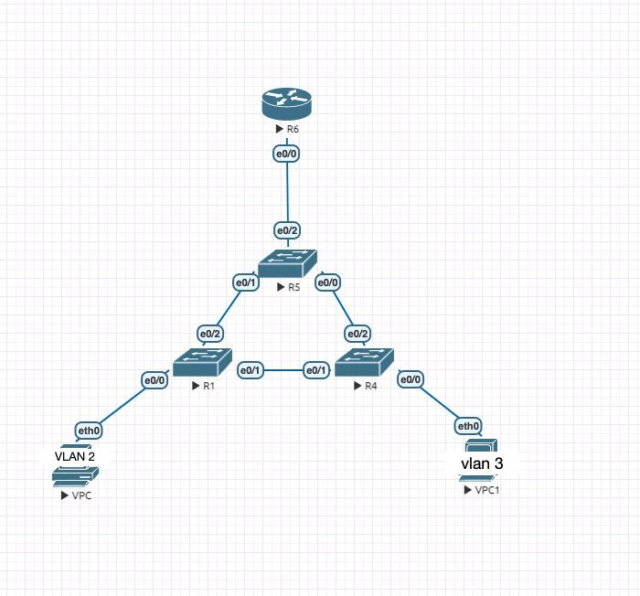
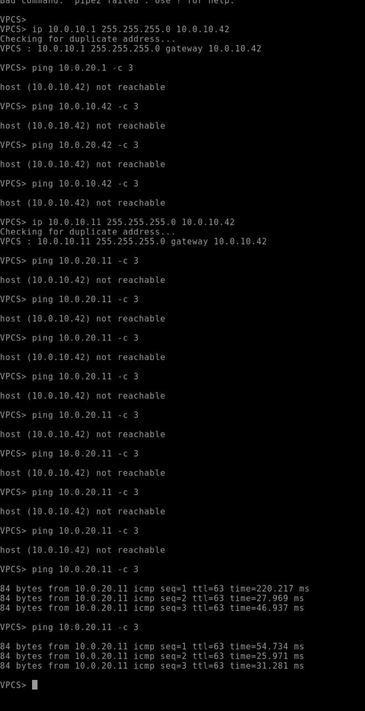
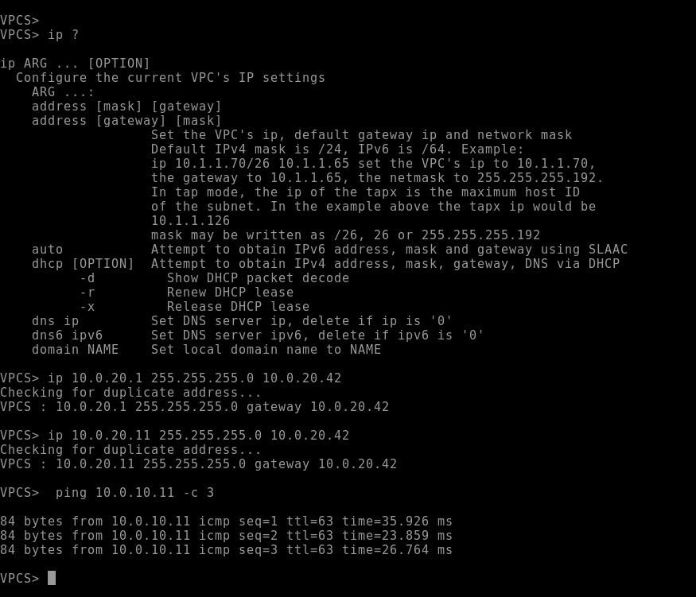

Сделано согласно требованиям дз.
Линк между свитчами доступа заблокирован по протоколу stp, так как свитч уровня распределения является корнем. Отключил vtp на всех свитчах.
Дополнительно я закинул конфиги в configs_txt. Но есть и лаба lab.unl

