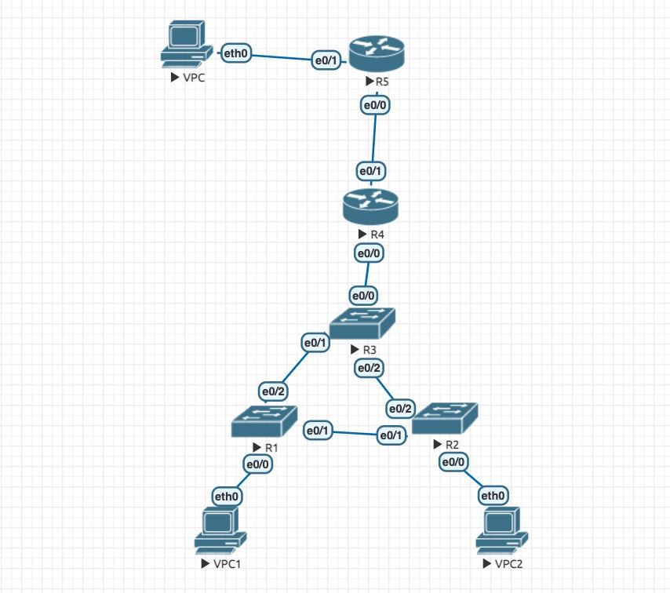
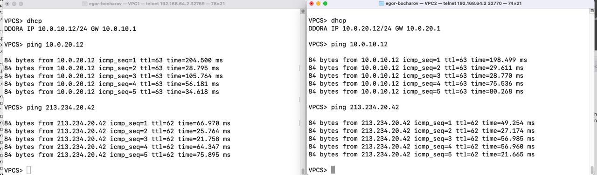

Исправлены замечания с ДЗ1, теперь вланы 10 и 20. Для шлюзов используется первый/последний адрес сети.

На R4 настроен PAT трансляция серых ip в один белый и настроен DHCP. В схеме задан VPC как вневшний ресурс. 

