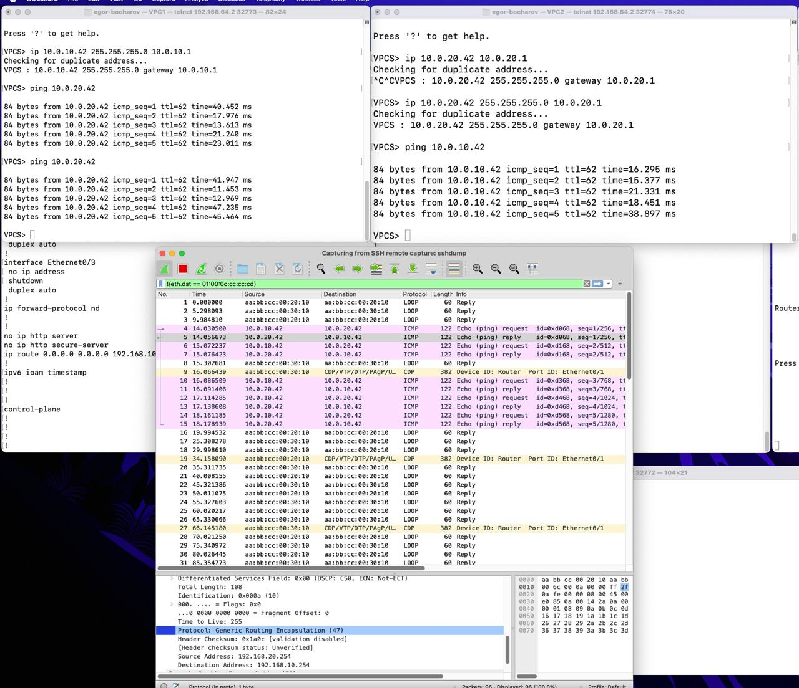

Общая схема на картине с ip адресами

Заданы 2 тунеля, VPCS1-VPCS2 GRE, VPCS1-VPCS3 GRE + IPSec. В каждом тунеле в силу GRE MTU понижен до 1400, MSS до 1360. IPSec настроен с алгоритм шифрования AES и с протоколом ESP с алгоритмом аутентификации SHA. 

Работа GRE туннеля между VPC1-VPC2:

Между VPC1-VPC3:

Работа GRE между VPC1-VPC2 и GRE+IPSec между VPC1-VPC3:
